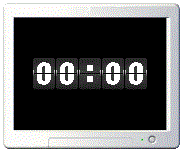

# Numbers Screensaver

A simple screensaver for Windows built using [SFML](https://www.sfml-dev.org).

*Please note this program originated as a "one hour jam" spare time project for a friend. Don't expect the best design ever!*

## Download

You can download a prebuilt release from the **Releases** tab above.

## Installation

After downloading (or building), move **numbers.png** and **numbers.scr** to `C:\Windows\System32`.
You should then be able to select and use the screensaver.

## Editing

If you'd like to edit the numbers displayed (changing colors or font), I'd suggest doing so by modifying the provided [numbers.afdesign](numbers.afdesign) file. You'll need [Affinity Designer](https://affinity.serif.com/en-us/designer/) or another compatible program for this.

## Building

If you'd like to modify and/or build the screensaver yourself, you'll need [CMake](https://www.cmake.org/) and [SFML](https://www.sfml-dev.org/).
To create your project or makefiles, simply run `cmake path/to/the/source`.

## License

The code in this repository is released under the MIT License, while the images are CC-BY-NC-SA. See [license.md](license.md) for more details.
